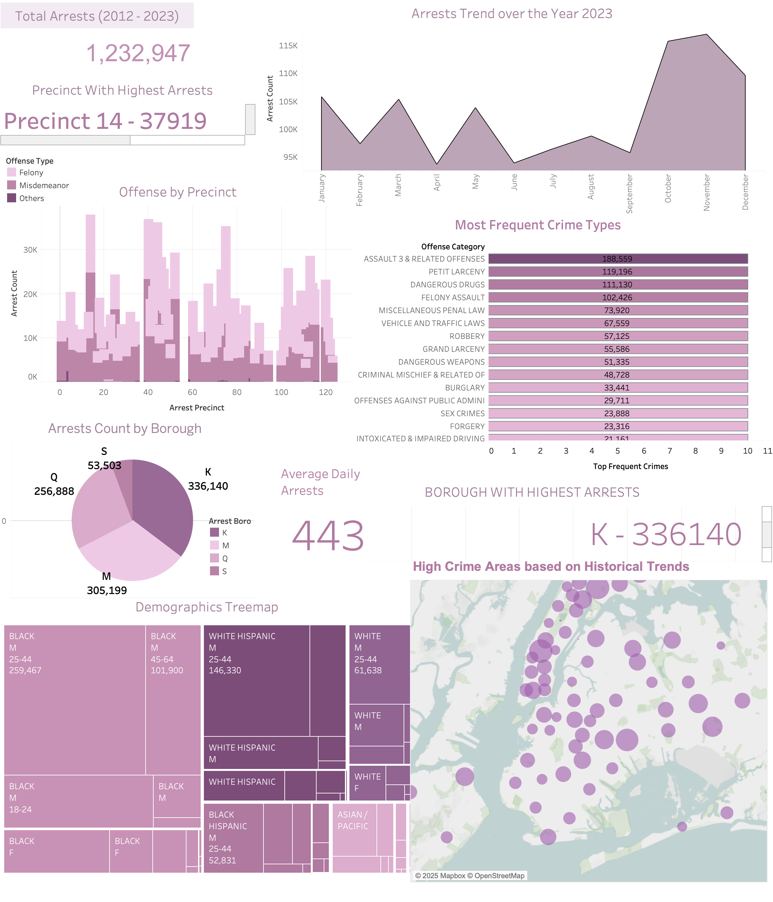

# **NYPD Crime & Arrests Data Pipeline**  

## **Overview**  
This project focuses on designing a scalable and efficient data pipeline for NYPD crime and arrest data. The data is sourced from the NYPD website, updated regularly since June 5, 2018, and initially contained 260,503 records at the time of analysis.  

## **Technologies Used**  

## **Problem Statement**  

### **Challenge**  
- The dataset contained missing values, inconsistencies, and data type errors.  
- A robust data model was required to support analytical queries on crime and arrests.  
- Efficient data ingestion, transformation, and loading into Snowflake were needed for large-scale analysis.  

### **Solution**  
- **Dimensional Modeling**: Designed a star schema using **ER Studio** to optimize query performance.  
- **Data Profiling**: Used **yDataProfiling** to assess data quality issues and identify necessary transformations.  
- **Data Cleaning & Transformation**: Applied **Alteryx** workflows to clean and standardize the dataset.  
- **Data Pipeline Implementation**: Built an **Azure Data Factory** pipeline to load transformed data into **Snowflake** efficiently.  

### Step 1: Data Profiling

### Step 2: Dimension Modeling

### Step 3: Data Cleaning and Transformation using Alteryx

### Step 4: Azure Data Factory Mapping

### Step 5: Snowflake Data

### Step 6: Data Visualization and Analysis
